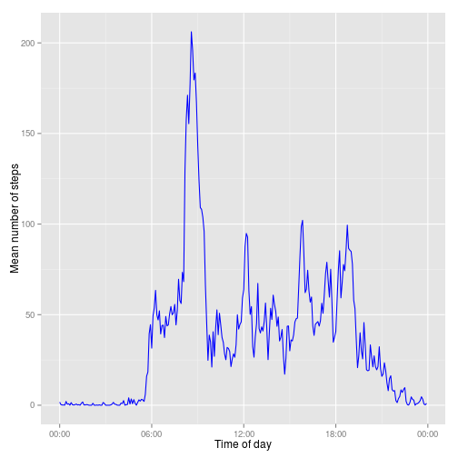
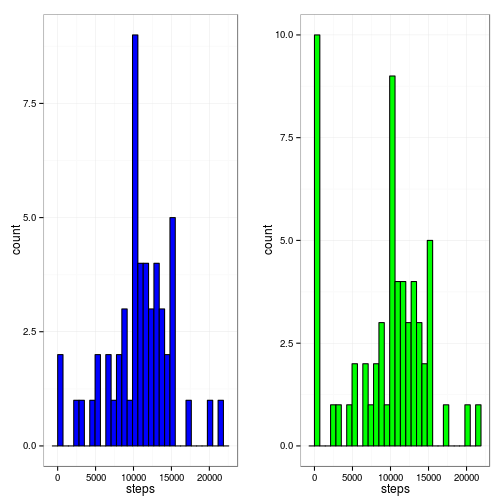
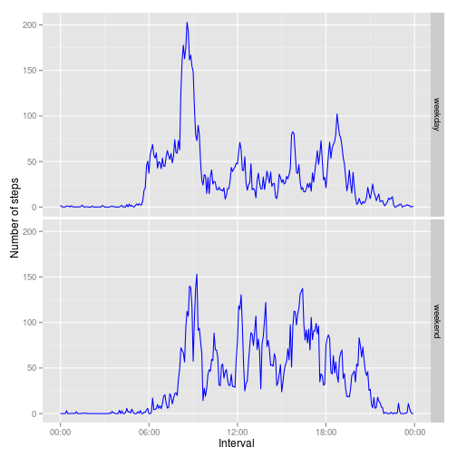

This is my solution for the first peer assignment for the Reproducible Reseach (repdata-005) which is part of the Data Scientist specialization on Coursera. This assignment makes use of data from a personal activity monitoring device. This device collects data at 5 minute intervals through out the day. The data consists of two months of data from an anonymous individual collected during the months of October and November, 2012 and include the number of steps taken in 5 minute intervals each day.

## Loading and preprocessing the data

*This section implies that you already downloaded and extracted the data file.*

Let's us load all packages needed for this assignment:


```r
library(scales)
library(grid)
library(ggplot2)
```

First we need to load data onto R and have a first look into it:


```r
data <- read.csv("activity.csv")
head(data)
```

```
##   steps       date interval
## 1    NA 2012-10-01        0
## 2    NA 2012-10-01        5
## 3    NA 2012-10-01       10
## 4    NA 2012-10-01       15
## 5    NA 2012-10-01       20
## 6    NA 2012-10-01       25
```

```r
str(data)
```

```
## 'data.frame':	17568 obs. of  3 variables:
##  $ steps   : int  NA NA NA NA NA NA NA NA NA NA ...
##  $ date    : Factor w/ 61 levels "2012-10-01","2012-10-02",..: 1 1 1 1 1 1 1 1 1 1 ...
##  $ interval: int  0 5 10 15 20 25 30 35 40 45 ...
```
It is noticed that the file has three columns: two type integer, and one type factor.

It would be nice to have a column on data that could represent the date and time for each line. The interval column grows by five and it patterns like HH00, HH05, HH10 and so forth with HH being the hour of the day. A simple math of dividing the interval by 100 and putting it together with the date column solves this issue.


```r
data$datetime <- as.character.POSIXt(data$interval/100)
data$datetime <- as.POSIXct(paste(data$date, data$datetime),format='%Y-%m-%d %H.%M',tz='GMT')
```

Also, I decided to put one column containing only the hour:


```r
data$hour <- format(data$datetime, format='%H:%M:%S')
```

## What is mean total number of steps taken per day?

You can take this mean and the median by two ways: one is using summary function and the other is using mean and median function.


```r
summary(data)
```

```
##      steps               date          interval   
##  Min.   :  0.0   2012-10-01:  288   Min.   :   0  
##  1st Qu.:  0.0   2012-10-02:  288   1st Qu.: 589  
##  Median :  0.0   2012-10-03:  288   Median :1178  
##  Mean   : 37.4   2012-10-04:  288   Mean   :1178  
##  3rd Qu.: 12.0   2012-10-05:  288   3rd Qu.:1766  
##  Max.   :806.0   2012-10-06:  288   Max.   :2355  
##  NA's   :2304    (Other)   :15840                 
##     datetime                       hour          
##  Min.   :2012-10-01 00:00:00   Length:17568      
##  1st Qu.:2012-10-16 05:58:45   Class :character  
##  Median :2012-10-31 11:57:30   Mode  :character  
##  Mean   :2012-10-31 11:57:30                     
##  3rd Qu.:2012-11-15 17:56:15                     
##  Max.   :2012-11-30 23:55:00                     
## 
```

```r
mean(data$steps, na.rm = TRUE)
```

```
## [1] 37.38
```

```r
median(data$steps, na.rm = TRUE)
```

```
## [1] 0
```

The summary gives us more than just the mean for the whole dataframe whereas the mean function we have to specify which column do we want the mean. Note that the mean function has more precision than the summary, but for both values the final result is the same.

But that aren't the numbers we are looking for. Since the data is taken every five minutes, we need to aggregate this data by date. That can be done using the aggregate function:


```r
dataForHist <- aggregate(steps ~ date, data, sum)
summary(dataForHist)
```

```
##          date        steps      
##  2012-10-02: 1   Min.   :   41  
##  2012-10-03: 1   1st Qu.: 8841  
##  2012-10-04: 1   Median :10765  
##  2012-10-05: 1   Mean   :10766  
##  2012-10-06: 1   3rd Qu.:13294  
##  2012-10-07: 1   Max.   :21194  
##  (Other)   :47
```

```r
naMean <- mean(dataForHist$steps, na.rm = TRUE)
naMedian <- median(dataForHist$steps, na.rm = TRUE)
naMean
```

```
## [1] 10766
```

```r
naMedian
```

```
## [1] 10765
```

Here is the histogram of the total number of steps taken each day:


```r
histogram1 <- ggplot(dataForHist, aes(steps)) + 
    geom_histogram(fill="blue", color="black") +  
    theme_bw()
histogram1
```

```
## stat_bin: binwidth defaulted to range/30. Use 'binwidth = x' to adjust this.
```

 

```r
rm(dataForHist)
```

## What is the average daily activity pattern?

To plot the average daily activity pattern, we must first calculate the mean of steps for every 5 minutes and do some hour formatting:


```r
dataForTimeSeries <- aggregate(steps~hour,data,mean,na.rm=T)
dataForTimeSeries$hour <- as.POSIXct(dataForTimeSeries$hour, format="%H:%M")
dataForTimeSeries[dataForTimeSeries$steps == max(dataForTimeSeries$steps),]
```

```
##                    hour steps
## 104 2014-08-17 08:35:00 206.2
```

Here's the time series of the 5-minute interval (x-axis) and the average number of steps taken, averaged across all days (y-axis) and the 5-minute interval that contains the maximum number of steps in average is at 08:35 with 206,1698 steps.


```r
ggplot(dataForTimeSeries, aes(hour, steps)) +
    geom_line(color="blue") +
    xlab('Time of day') +
    ylab('Mean number of steps') +  
    scale_x_datetime(labels=date_format(format='%H:%M'))
```

 

```r
rm(dataForTimeSeries)
```

## Imputing missing values

Note that there are a number of days/intervals where there are missing values (coded as NA). The presence of missing days may introduce bias into some calculations or summaries of the data. We have 2304 missing values.


```r
sum(is.na(data))
```

```
## [1] 2304
```

Let's fill in these values and compute mean, median and histogram one more time.


```r
data[is.na(data)] <- median(data$steps, na.rm = TRUE)
dataForHist <- aggregate(steps ~ date, data, sum)

histogram2 <- ggplot(dataForHist, aes(steps)) + 
    geom_histogram(fill="green", color="black") +  
    theme_bw() 

pushViewport(viewport(layout = grid.layout(1, 2)))
print(histogram1, vp = viewport(layout.pos.row = 1, layout.pos.col = 1))
```

```
## stat_bin: binwidth defaulted to range/30. Use 'binwidth = x' to adjust this.
```

```r
print(histogram2, vp = viewport(layout.pos.row = 1, layout.pos.col = 2))
```

```
## stat_bin: binwidth defaulted to range/30. Use 'binwidth = x' to adjust this.
```

 

The difference between both histograms is that, when we fill up the missing values, there's a peak at the wee-hours (probably when the subject was sleeping), and the high peak in the middle decreases a bit.


```r
nonNaMean <- mean(dataForHist$steps, na.rm = TRUE)
nonNaMedian <- median(dataForHist$steps, na.rm = TRUE)

paste("Mean: before[",naMean,"] after[",nonNaMean,"]")
```

```
## [1] "Mean: before[ 10766.1886792453 ] after[ 9354.22950819672 ]"
```

```r
paste("Median: before[",naMedian,"] after[",nonNaMedian,"]")
```

```
## [1] "Median: before[ 10765 ] after[ 10395 ]"
```

```r
rm(dataForHist)
```

We have a decrease on mean and medium values. It was more sensible on the mean because mean takes in consideration how many values are we using to compute it. Since the number os items had an increase, the mean was expected to be lower.

## Are there differences in activity patterns between weekdays and weekends?

Let's add a new factor column called weekday containing two levels:


```r
data$weekd <- weekdays(as.Date(data$date))
data[data$weekd == "Saturday",]$weekd <- "weekend"
data[data$weekd == "Sunday",]$weekd <- "weekend"
data[data$weekd != "weekend",]$weekd <- "weekday"
data$weekd <- factor(data$weekd)
```

Let's check the time series for he 5-minute interval (x-axis) and the average number of steps taken, averaged across all weekday days or weekend days (y-axis):


```r
dataForTimeSeries <- aggregate(steps~hour+weekd,data,mean,na.rm=T)
dataForTimeSeries$hour <- as.POSIXct(dataForTimeSeries$hour, format="%H:%M")

ggplot(dataForTimeSeries, aes(hour, steps)) +
    geom_line(color="blue") +
    xlab('Interval') +
    ylab('Number of steps') +  
    scale_x_datetime(labels=date_format(format='%H:%M')) +
    facet_grid(weekd ~ .)
```

 
